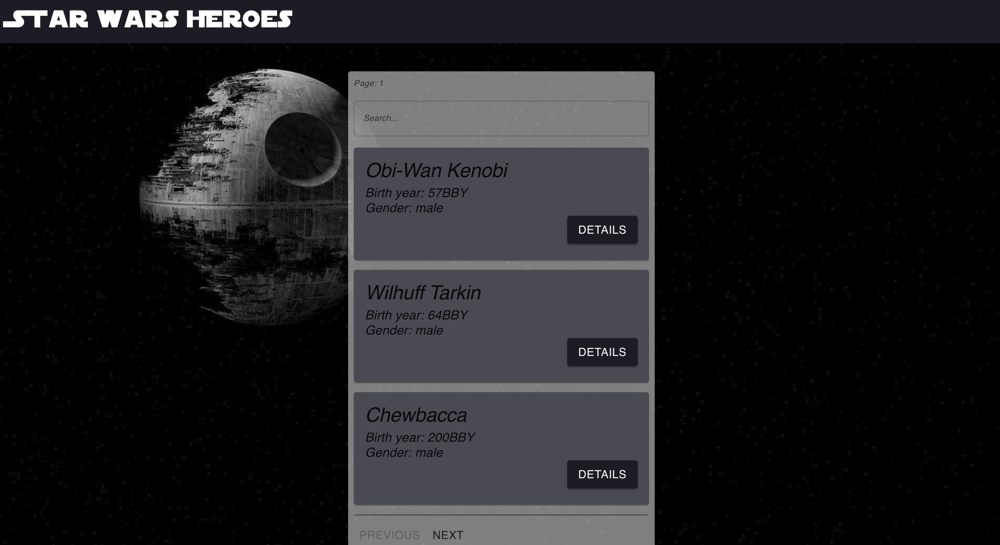
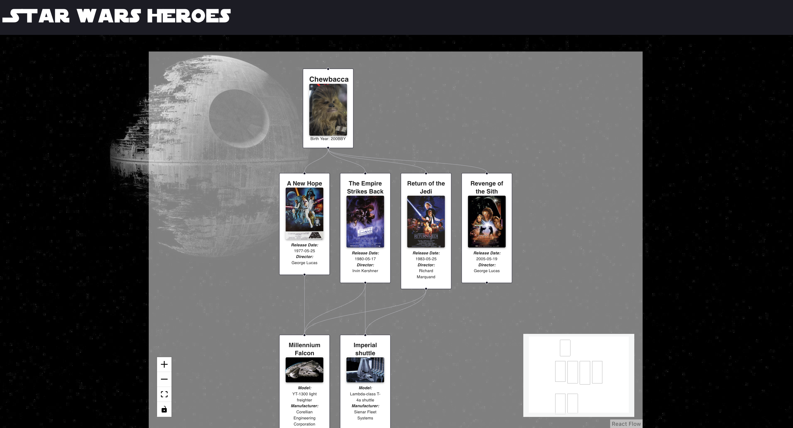
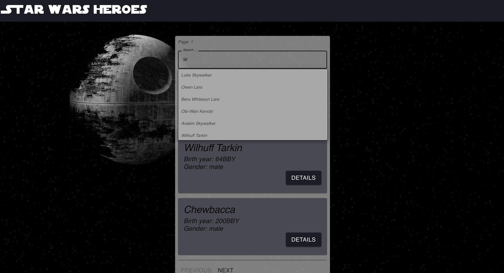

# StarWars
TS, React, React Flow, Redux Toolkit

____

## 📜 Main Information

This web application allows users to browse a list of Star Wars heroes, 
as well as detailed information about the starships and films associated with each hero. 
The application provides an interactive experience by visualizing the 
relationships between heroes, starships, and films in a graph format.

The search bar can be useful if users want to find a hero.
____

## Stack

✅ HTML (TSX), CSS

✅ TypeScript

✅ React

✅ React Router

✅ React Flow

✅ Redux Toolkit

✅ Material UI

✅ Jest

____

## Installation and Usage

The project consists of two parts: the server and the client.

**Installation:**

* Clone the repository: git clone https://github.com/reyand8/StarWars.git

**Usage:**

* Client
    - Navigate to the project directory: cd star-wars
    - Install dependencies: yarn install
        - Run the project: yarn start
        - Open a browser and navigate to: http://localhost:3000

____

## Examples

___________________________
___________________________

___________________________
___________________________

